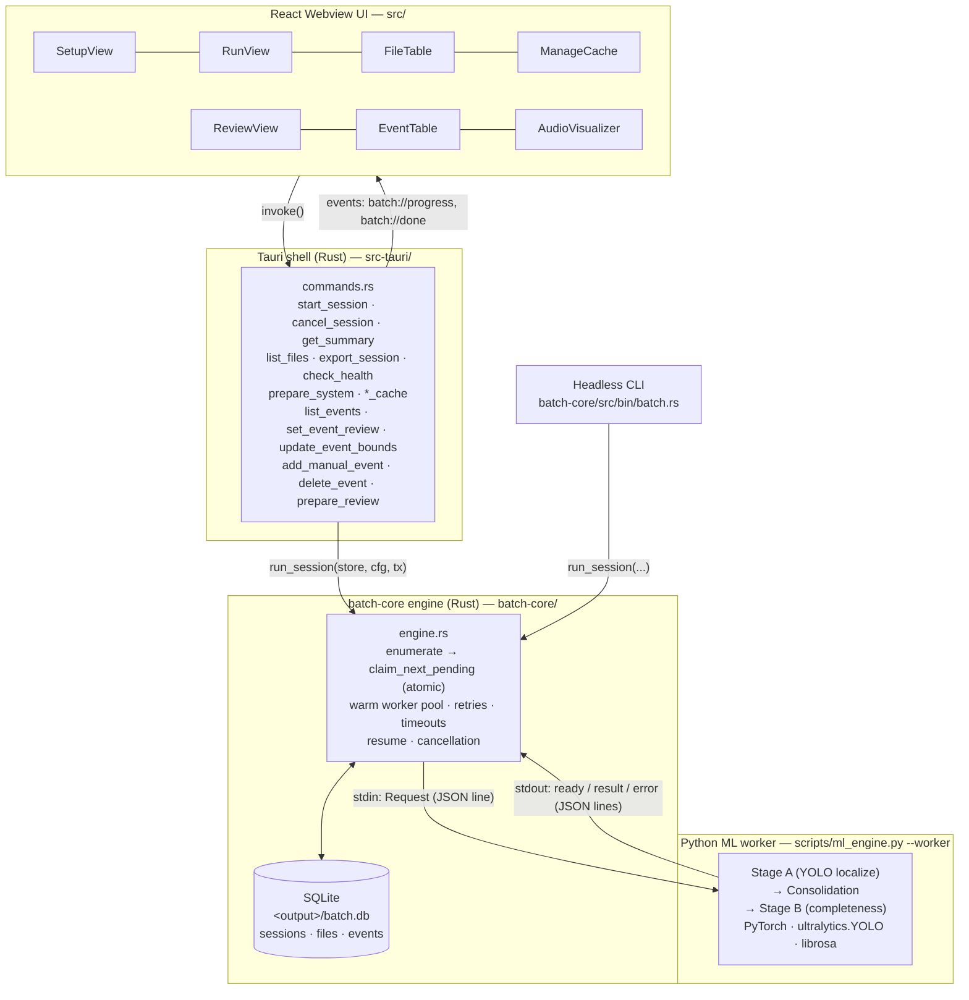
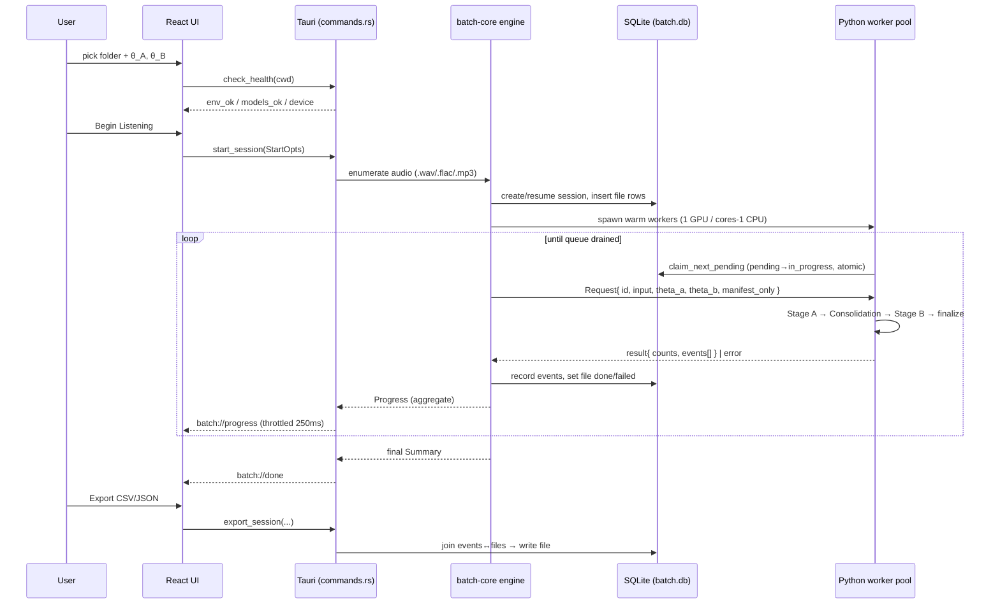
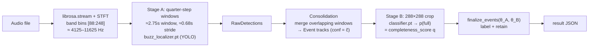

# Bird Audio Analyzer — System Architecture

> Status: prototype (`leyang/pwa-prototype`). This document describes the system as
> built today, grounded in the source. File references are clickable in most editors.

## 1. What it is

A single Tauri desktop app that batch-processes folders of field recordings to
detect the high-frequency **"buzz"** call of the Hume's Leaf Warbler
(*Phylloscopus humei*), then lets you curate the ML detections in an interactive
Review mode. A Python/PyTorch ML pipeline does the inference; a Rust engine (the
`batch-core` workspace crate at the repo root) orchestrates the batch; a Tauri +
React shell drives both modes.

## 2. Layered architecture & process boundaries

There are **four layers across three OS processes**: the Tauri shell and the
batch-core engine are the same process (engine called in-process by the
commands), the React UI runs in the system WebView, and each ML worker is a
long-lived Python subprocess.



Two front doors share one engine: the **Tauri GUI** and a headless **CLI**
(`batch-core/src/bin/batch.rs`). Audio files in Review mode are served via
Tauri's asset protocol — `prepare_review` grants the asset-protocol scope for
the session's input roots, and the UI loads audio with `convertFileSrc()`.

## 3. End-to-end data flow



Because all state lives in `batch.db`, runs are **resumable and idempotent**:
done files are skipped on re-run, and any `in_progress` files orphaned by a crash
are reset to `pending` (`engine.rs` `reset_in_progress`, `store.rs`
`find_resumable`). That database *is* the "cache" the ManageCache panel manages.

## 4. Worker protocol

Newline-delimited JSON over the worker's stdin/stdout
(`batch-core/src/protocol.rs`, `birdpipe/worker.py`):

| Direction | Message | Shape (key fields) |
|---|---|---|
| engine → worker | `Request` | `{ id, input, manifest_only, theta_a, theta_b, emit_raw }` |
| worker → engine | `ready` | `{ type:"ready", device }` (once, on startup) |
| worker → engine | `result` | `{ type:"result", id, n_windows, n_raw, n_events, n_complete, n_retained, elapsed_ms, events[] }` |
| worker → engine | `error` | `{ type:"error", id?, input?, message, traceback? }` |

Workers are **warm**: the model is loaded once at startup, then the process loops
over many `Request` lines — one bad file never stops the loop
(`birdpipe/worker.py:23-51`).

## 5. The ML pipeline (one file)

All in `scripts/ml_engine.py:process_file`, constants from the paper in
`birdpipe/constants.py`.



- **Feature extraction** — `librosa.stream` reads the file in blocks; STFT
  (`n_fft=1024`, `hop=256`) keeps bins **[88:248] ≈ 4125–11625 Hz**, the
  warbler's buzz band (`constants.py:14-18`).
- **Stage A (quarter-step detection)** — a 4-block window (**≈ 2.75 s**) slides
  forward one block (**≈ 0.68 s**) so no call falls between windows; each window
  → dB-spectrogram image → `buzz_localizer.pt` YOLO (internal floor `conf=0.25`)
  → candidate boxes mapped to absolute time/frequency (`ml_engine.py:119-145`).
- **Consolidation** — the same buzz appears in several overlapping windows;
  `consolidate.consolidate` merges them into event-level tracks via affinity
  scoring (IoU in time/freq, strong/support link gates, edge absorption —
  `constants.py:54-81`). Each `Event` carries `conf = c̃ = max member confidence`.
- **Stage B (completeness curation)** — per event, a standardized 288×288 crop is
  built and `classifier.pt` returns **`p("full")`** = `completeness_score` — how
  *complete/clean* the buzz is, **not which species it is** (`stageb.py:64-69`).

## 6. Detection Sensitivity (θ_A) & Quality Filter (θ_B)

Both are **post-processing thresholds** applied at the very end
(`birdpipe/records.py:9-17`). They do **not** change what is detected — only which
events are *labeled* and *kept*:

```python
q = e.completeness_score                          # p(full) from Stage B, 0..1
e.completeness_label = "complete" if q >= theta_b else "incomplete"
e.retained           = (e.conf >= theta_a) and (q >= theta_b)
```

Each event has two independent scores and two gates:

| Score | Produced by | Gated by | Meaning |
|---|---|---|---|
| `conf` (c̃) | Stage A YOLO detector | **θ_A** | How confident we are *this is a buzz at all* |
| `completeness_score` (q) | Stage B classifier | **θ_B** | How *complete/clean* the buzz is (full vs clipped/partial) |

**θ_A — Detection Sensitivity** (default `0.0`; UI hint *"lower = more buzzes"*)
- A floor on detection confidence: an event survives only if `conf ≥ θ_A`.
- **Lower → more buzzes** (higher recall, more false positives). At `0.0`, every
  consolidated event is eligible.
- **Higher → only high-confidence buzzes** (higher precision, fewer events).

**θ_B — Quality Filter** (default `0.530306`; UI hint *"higher = stricter"*)
- A threshold on completeness probability. It sets `completeness_label`
  (`complete` if `q ≥ θ_B`) and is the second condition for retention.
- **Higher → stricter** (only the cleanest, fully-formed buzzes count as complete).
- **Lower → more lenient** (partial/clipped buzzes also pass).
- The default `0.530306` is the validation-derived operating point from the paper
  (`constants.py:89`).

**The three result counts** in the RunView summary map directly onto these gates:

| Count | Definition |
|---|---|
| `n_events` | all consolidated events (no threshold) |
| `n_complete` | events passing the **quality** gate (`q ≥ θ_B`) |
| `n_retained` | events passing **both** gates (`conf ≥ θ_A` **and** `q ≥ θ_B`) — the analysis-ready set |

Intuitively: **θ_A = "how much is it a buzz?"**, **θ_B = "how good/complete a
buzz is it?"**, and `retained` is the intersection.

## 7. Persistence schema (SQLite)

`<output_dir>/batch.db`, WAL mode (`batch-core/src/store.rs`):

- **sessions** — one row per run: `input_roots`, `output_dir`, `device`,
  `concurrency`, `theta_a`, `theta_b`, `total_files`, `status`.
- **files** — one row per recording: `path`, `status`
  (`pending`/`in_progress`/`done`/`failed`), per-file counts, `error`,
  `attempts`. `UNIQUE(session_id, path)` enables idempotent re-runs.
- **events** — one row per consolidated event:
  - ML fields: `t_start`, `t_end`, `duration`, `f_low`, `f_high`,
    `center_freq`, `stage_a_conf`, `completeness_score`, `completeness_label`,
    `retained`, `n_members`.
  - Curation fields (added by idempotent migration on `Store::open`):
    `review_status` (`unreviewed` / `confirmed` / `rejected`, default
    `unreviewed`), `source` (`ml` / `manual`, default `ml`), `label`
    (free-text species/call label), `note` (free-text annotation),
    `reviewed_at` (ISO timestamp set on every `set_event_review` call).
  - Manual events inserted by `add_manual_event` start with
    `source='manual'`, `review_status='confirmed'`, and no ML scores.

## 8. Concurrency, retries, cancellation

- **Pool size** — `1` worker on GPU (cuda/mps), `cores − 1` on CPU; an explicit
  `concurrency` overrides (`batch-core/src/concurrency.rs`).
- **Work distribution** — each worker atomically claims the next `pending` file
  (`UPDATE … RETURNING`), so no two workers grab the same file.
- **Retries / timeouts** — per-file timeout; on timeout/disconnect the worker is
  killed and the file is requeued until `max_attempts`, then marked `failed`.
- **Cancellation** — a shared `AtomicBool`; workers stop after the current file
  (in-flight work is not preempted).

## 9. Export

`events` joined to `files`, ordered by path then time, written as **CSV** or
**JSON** (`batch-core/src/export.rs`). Two optional filters:
- `complete_only` — restricts to `completeness_label = 'complete'` (Stage B quality gate).
- `confirmed_only` — restricts to `review_status = 'confirmed'` (human-curated events only; includes manual events).

Both flags are accepted by `export_session` in `src-tauri/src/commands.rs` and
forwarded to `export_csv` / `export_json`.
