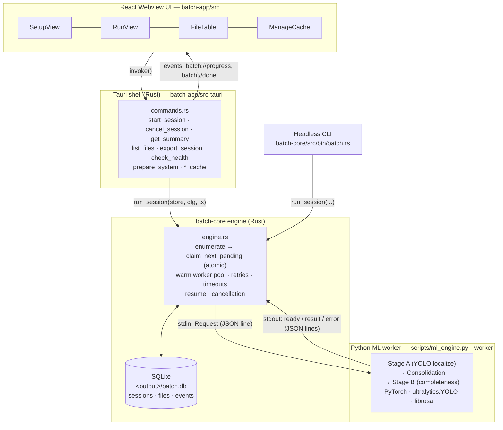
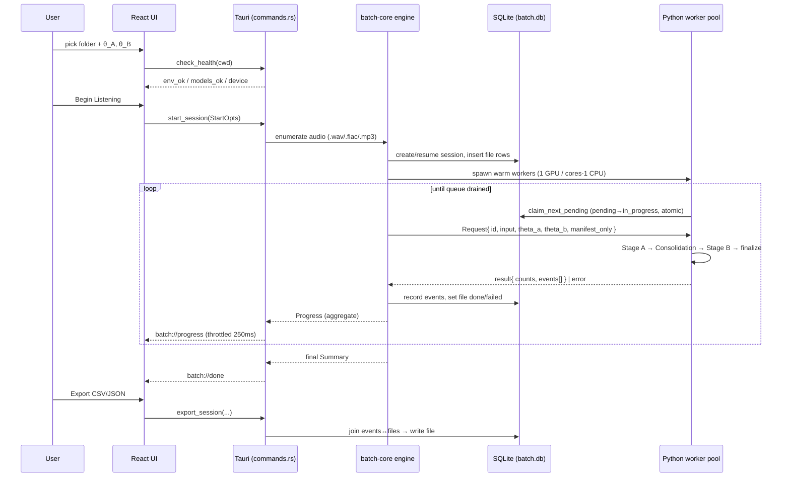
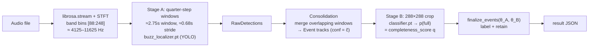

# Bird Audio Analyzer — System Architecture

> Status: prototype (`leyang/prototype`). This document describes the system as
> built today, grounded in the source. File references are clickable in most editors.
>
> This is the **conceptual overview**. For the developer reference — full IPC
> surface, worker-protocol schemas, data model, CLI, and build/packaging — see
> [`batch-app.md`](batch-app.md).

## 1. What it is

A desktop app that batch-processes folders of field recordings to detect the
high-frequency **"buzz"** call of the Hume's Leaf Warbler (*Phylloscopus humei*).
A Python/PyTorch ML pipeline does the inference; a Rust engine orchestrates the
batch; a Tauri + React shell drives it.

## 2. Layered architecture & process boundaries

There are **four layers across three OS processes**: the Tauri shell and the
batch-core engine are the same process (engine called in-process by the
commands), the React UI runs in the system WebView, and each ML worker is a
long-lived Python subprocess.



Two front doors share one engine: the **Tauri GUI** and a headless **CLI**
(`batch-core/src/bin/batch.rs`).

## 3. End-to-end data flow



Because all state lives in `batch.db`, runs are **resumable and idempotent**:
done files are skipped on re-run, and any `in_progress` files orphaned by a crash
are reset to `pending` (`engine.rs` `reset_in_progress`, `store.rs`
`find_resumable`). That database *is* the "cache" the ManageCache panel manages.

## 4. Worker protocol

Newline-delimited JSON over the worker's stdin/stdout
(`batch-core/src/protocol.rs`, `birdpipe/worker.py`):

| Direction | Message | Shape (key fields) |
|---|---|---|
| engine → worker | `Request` | `{ id, input, manifest_only, theta_a, theta_b, emit_raw }` |
| worker → engine | `ready` | `{ type:"ready", device }` (once, on startup) |
| worker → engine | `result` | `{ type:"result", id, n_windows, n_raw, n_events, n_complete, n_retained, elapsed_ms, events[] }` |
| worker → engine | `error` | `{ type:"error", id?, input?, message, traceback? }` |

Workers are **warm**: the model is loaded once at startup, then the process loops
over many `Request` lines — one bad file never stops the loop
(`birdpipe/worker.py:23-51`).

## 5. The ML pipeline (one file)

All in `scripts/ml_engine.py:process_file`, constants from the paper in
`birdpipe/constants.py`. The full numeric parameter set is tabulated in
[§10](#10-pipeline-parameter-reference-paper-constants).



- **Feature extraction** — `librosa.stream` reads the file in blocks; STFT
  (`n_fft=1024`, `hop=256`) keeps bins **[88:248] ≈ 4125–11625 Hz**, the
  warbler's buzz band (`constants.py:14-18`).
- **Stage A (quarter-step detection)** — a 4-block window (**≈ 2.75 s**) slides
  forward one block (**≈ 0.68 s**) so no call falls between windows; each window
  → dB-spectrogram image → `buzz_localizer.pt` YOLO (internal floor `conf=0.25`)
  → candidate boxes mapped to absolute time/frequency (`ml_engine.py:119-145`).
- **Consolidation** — the same buzz appears in several overlapping windows;
  `consolidate.consolidate` merges them into event-level tracks via affinity
  scoring (IoU in time/freq, strong/support link gates, edge absorption —
  `constants.py:54-81`). Each `Event` carries `conf = c̃ = max member confidence`.
- **Stage B (completeness curation)** — per event, a standardized 288×288 crop is
  built and `classifier.pt` returns **`p("full")`** = `completeness_score` — how
  *complete/clean* the buzz is, **not which species it is** (`stageb.py:64-69`).

## 6. Detection Sensitivity (θ_A) & Quality Filter (θ_B)

Both are **post-processing thresholds** applied at the very end
(`birdpipe/records.py:9-17`). They do **not** change what is detected — only which
events are *labeled* and *kept*:

```python
q = e.completeness_score                          # p(full) from Stage B, 0..1
e.completeness_label = "complete" if q >= theta_b else "incomplete"
e.retained           = (e.conf >= theta_a) and (q >= theta_b)
```

Each event has two independent scores and two gates:

| Score | Produced by | Gated by | Meaning |
|---|---|---|---|
| `conf` (c̃) | Stage A YOLO detector | **θ_A** | How confident we are *this is a buzz at all* |
| `completeness_score` (q) | Stage B classifier | **θ_B** | How *complete/clean* the buzz is (full vs clipped/partial) |

**θ_A — Detection Sensitivity** (default `0.0`; UI hint *"lower = more buzzes"*)
- A floor on detection confidence: an event survives only if `conf ≥ θ_A`.
- **Lower → more buzzes** (higher recall, more false positives). At `0.0`, every
  consolidated event is eligible.
- **Higher → only high-confidence buzzes** (higher precision, fewer events).

**θ_B — Quality Filter** (default `0.530306`; UI hint *"higher = stricter"*)
- A threshold on completeness probability. It sets `completeness_label`
  (`complete` if `q ≥ θ_B`) and is the second condition for retention.
- **Higher → stricter** (only the cleanest, fully-formed buzzes count as complete).
- **Lower → more lenient** (partial/clipped buzzes also pass).
- The default `0.530306` is the validation-derived operating point from the paper
  (`constants.py:89`).

**The three result counts** in the RunView summary map directly onto these gates:

| Count | Definition |
|---|---|
| `n_events` | all consolidated events (no threshold) |
| `n_complete` | events passing the **quality** gate (`q ≥ θ_B`) |
| `n_retained` | events passing **both** gates (`conf ≥ θ_A` **and** `q ≥ θ_B`) — the analysis-ready set |

Intuitively: **θ_A = "how much is it a buzz?"**, **θ_B = "how good/complete a
buzz is it?"**, and `retained` is the intersection.

## 7. Persistence schema (SQLite)

`<output_dir>/batch.db`, WAL mode (`batch-core/src/store.rs`):

- **sessions** — one row per run: `input_roots`, `output_dir`, `device`,
  `concurrency`, `theta_a`, `theta_b`, `total_files`, `status`.
- **files** — one row per recording: `path`, `status`
  (`pending`/`in_progress`/`done`/`failed`), per-file counts, `error`,
  `attempts`. `UNIQUE(session_id, path)` enables idempotent re-runs.
- **events** — one row per consolidated event: time/frequency bounds,
  `stage_a_conf`, `completeness_score`, `completeness_label`, `retained`,
  `n_members`.

## 8. Concurrency, retries, cancellation

- **Pool size** — `1` worker on GPU (cuda/mps), `cores − 1` on CPU; an explicit
  `concurrency` overrides (`batch-core/src/concurrency.rs`).
- **Work distribution** — each worker atomically claims the next `pending` file
  (`UPDATE … RETURNING`), so no two workers grab the same file.
- **Retries / timeouts** — per-file timeout; on timeout/disconnect the worker is
  killed and the file is requeued until `max_attempts`, then marked `failed`.
- **Cancellation** — a shared `AtomicBool`; workers stop after the current file
  (in-flight work is not preempted).

## 9. Export

`events` joined to `files`, ordered by path then time, written as **CSV** or
**JSON** (`batch-core/src/export.rs`). `complete_only` restricts output to
`completeness_label = 'complete'`.

## 10. Pipeline parameter reference (paper constants)

Every value below is fixed in `birdpipe/constants.py` (paper §5.2, Table A.6,
Table A.8) unless noted; the YOLO inference-call params live in
`scripts/ml_engine.py` and `birdpipe/stageb.py`. These are the actual numbers the
two models run with — distinct from the user-facing **θ_A / θ_B** gates in §6,
which are applied *after* inference.

### 10.1 Audio & windowing (§5.2)

| Constant | Value | Meaning |
|---|---|---|
| `SAMPLE_RATE` | `48000` Hz | audio resample rate |
| `N_FFT` | `1024` | STFT window size |
| `HOP_LENGTH` | `256` | STFT hop |
| `BLOCK_FRAMES` | `128` | frames per `librosa.stream` block = **one quarter step** |
| `WINDOW_FRAMES` | `512` | analysis window = **4 blocks** |
| `FREQ_BIN_LOW`..`FREQ_BIN_HIGH` | `88`..`248` | kept STFT band → 160 rows |
| `F_MIN_HZ`..`F_MAX_HZ` | `4125.0`..`11625.0` Hz | the buzz frequency band |
| `DELTA_T` | ≈ `0.6827` s | window stride (`BLOCK_FRAMES·HOP/SR`) |
| `T_W` | ≈ `2.7467` s | window duration (`((WINDOW−1)·HOP + N_FFT)/SR`) |
| `SEC_PER_FRAME` | ≈ `0.005333` s | time resolution (`HOP/SR`) |

### 10.2 Stage A — buzz localization (`buzz_localizer.pt`, YOLO)

| Param | Value | Where | Meaning |
|---|---|---|---|
| `conf` floor | `0.25` | `ml_engine.py` (`BirdAudioPipeline(conf=0.25)`, CLI `--conf`) | YOLO detection-confidence floor at inference |
| `imgsz` | `(160, 512)` | `ml_engine.py` (`self.localizer(..., imgsz=(160,512))`) | inference image size (band-rows × window-cols) |
| input image | flipped, dB-normalized grayscale window, tiled to 3-channel uint8 | `ml_engine.py` | per-window spectrogram fed to the detector |
| `ingest_conf` | `0.001` | `constants.py` `ConsolidationParams` | floor below which raw detections are dropped before consolidation |

Output: per-window boxes mapped to absolute time/frequency via `coords.map_box` →
`RawDetection { t_start, t_end, f_low, f_high, conf, window, norm_left, norm_right }`.

### 10.3 Consolidation (Table A.6)

Merges overlapping per-window detections of the same buzz into one `Event`.

**Affinity weights** (Eq A.1; the last three — `center_t`, `center_f`,
`window_gap` — are *subtracted* penalties, the rest are added):

| `iou2d` | `iou_t` | `iou_f` | `dur_ratio` | `bw_ratio` | `min_conf` | `edge` | `center_t` | `center_f` | `window_gap` |
|---|---|---|---|---|---|---|---|---|---|
| +0.45 | +0.14 | +0.14 | +0.10 | +0.08 | +0.05 | +0.06 | −0.05 | −0.04 | −0.03 |

**Global:** `window_gap_max` (G) = `3`, `eta` (edge-proximity scale) = `0.08`.

| Gate | Thresholds |
|---|---|
| **Strong link** | affinity ≥ `0.72`, iou2d ≥ `0.55`, min_conf ≥ `0.25`, margin ≥ `0.04` |
| **Support link** | affinity ≥ `0.62`, iou2d ≥ `0.35`, min_conf ≥ `0.10`, margin ≥ `0.03`, gap ≤ `2`, edge_conf `0.70` / edge `0.50` |
| **Edge-singleton absorption** | score ≥ `0.72`, edge ≥ `0.80`, area ≥ `0.70`, time ≥ `0.55`, freq ≥ `0.55`, margin ≥ `0.08` |

Absorption-score weights: `area 0.55, time 0.15, freq 0.15, edge 0.08,
singleton_conf 0.04, track_conf 0.03, center_t −0.04, center_f −0.03`.
Each fused `Event` takes `conf = c̃ = max member confidence`.

### 10.4 Stage B — completeness curation (`classifier.pt`, YOLOv11-cls; Table A.8)

| Param | Value | Meaning |
|---|---|---|
| `crop_frames` | `288` | right-aligned temporal window (columns) ending at the event's `t_end` |
| `out_size` | `288` | final crop is `288×288`, aspect-preserving resize + **mean-gray padding** |
| `complete_class` | `"full"` | the class whose probability is read; score `q = p("full")` |
| `theta_b` | `0.530306` | default Quality-Filter operating point (see §6) |

Inference: `model(crop_rgb, verbose=False)[0]`, reading `res.probs.data[idx]` for
the `"full"` class (`stageb.py`). This is **completeness**, not species ID.

### 10.5 Retention thresholds (§5.5 — applied post-inference, see §6)

| Param | Default | Notes |
|---|---|---|
| `theta_a` | `0.0` | Detection Sensitivity; validation-derived, paper gives no number → configurable |
| `theta_b` | `0.530306` | Quality Filter; paper operating point |
