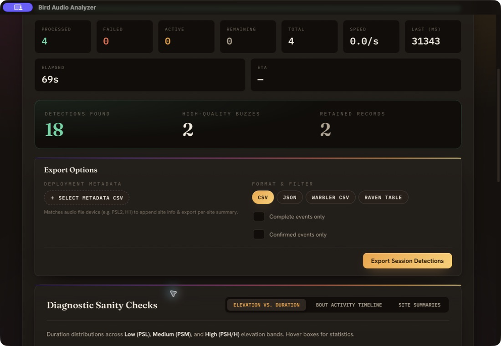
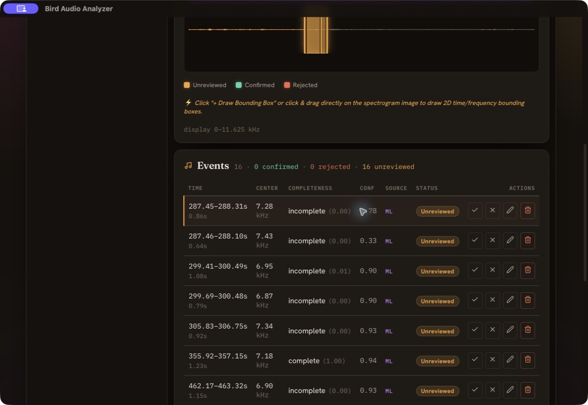
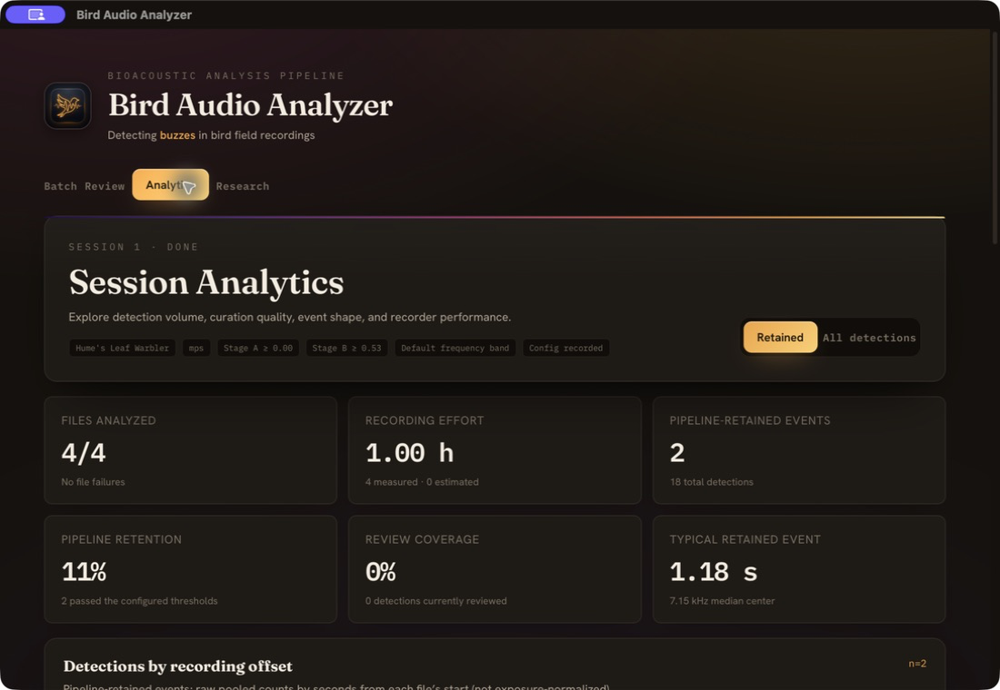
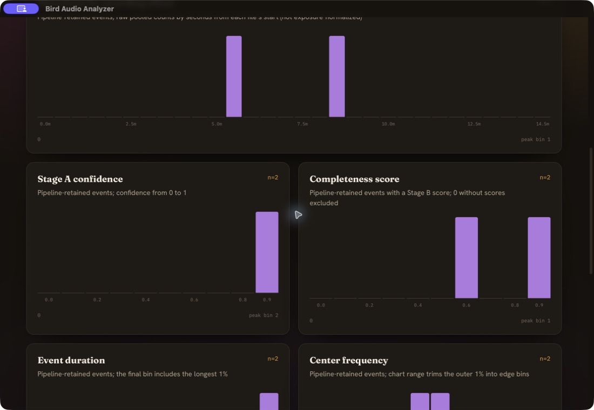
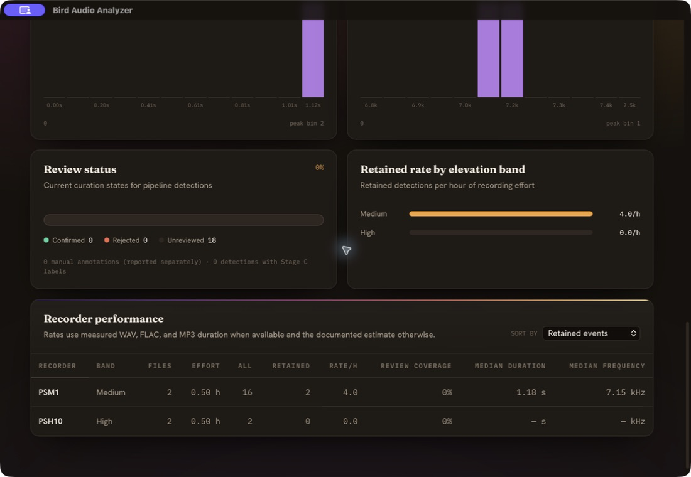
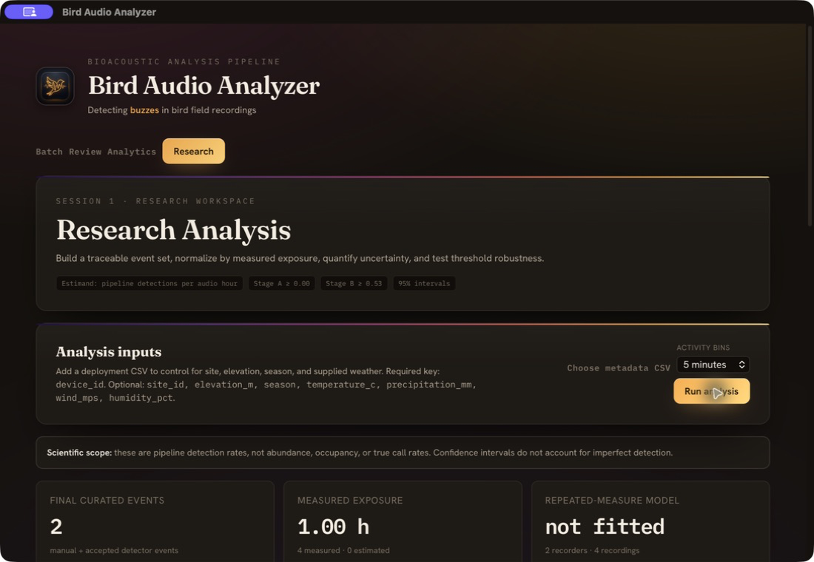
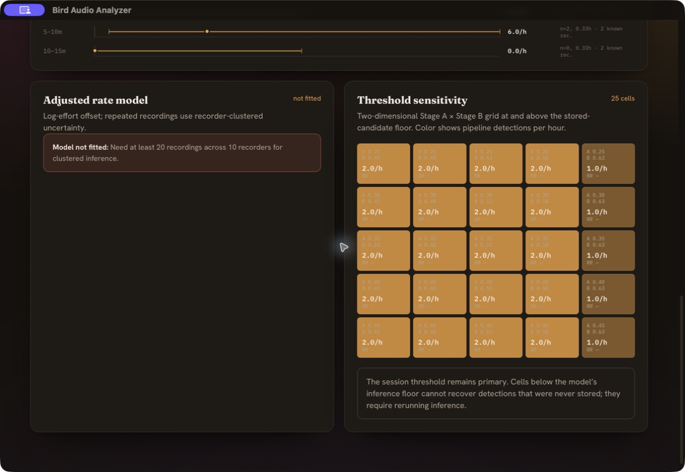

# Bird Audio Analyzer feature guide

This guide explains what each app feature does, when it is useful, and what it
does **not** establish scientifically. Screenshots were captured from the packaged
macOS app using a bounded documentation sample copied from
`/Volumes/Seagate/School/Sural_AudioMoths`: two PSH10 high-elevation recordings
(`20240606_040000.WAV`, `20240610_070000.WAV`) and two PSM1 mid-elevation
recordings (`20240526_040000.WAV`, `20240526_070000.WAV`). Each source file is a
15-minute, 82 MB AudioMoth WAV.

The four-file sample is intentionally too small for formal inference. Its purpose
is to demonstrate the workflow and its guardrails, not to estimate an elevation
effect or biological abundance.

## 1. Batch setup and progress

| Feature | What it does | Why it is useful | Important limit |
|---|---|---|---|
| Recording folder and Sural presets | Selects a folder recursively; presets jump to common Sural deployments. | Makes a recorder, deployment, or bounded validation set easy to run. | Selecting an elevation root can mean hundreds of files; verify the scope before starting. |
| Detection sensitivity (Stage A) | Sets the candidate-detection threshold. | Lower values retain more possible calls for later review. | A model score is not a calibrated probability of species presence. |
| Quality filter (Stage B) | Filters candidate events by predicted call completeness. | Lets clean calls be prioritized for measurement or review. | Completeness is not species identity. |
| Analysis target | Records species/call label, frequency band, and model paths. | Keeps the run configuration visible and reproducible. | A label does not validate that the model generalizes to a new site or season. |
| Progress and per-file status | Reports pending, active, done, and failed recordings. | Makes interrupted or bad recordings visible and supports safe resume. | Failed or cancelled sessions may be useful for diagnostics but are not complete research datasets. |

On resume, unchanged completed files are skipped. Changed files are reprocessed
and their stale detections are replaced; recordings removed from the input are
pruned from the resumed inventory.

## 2. Review and manual curation

| Feature | What it does | Why it is useful | Important limit |
|---|---|---|---|
| Spectrogram and playback | Displays sound energy over time and frequency and plays the corresponding audio. | Lets a reviewer combine visual and auditory evidence. | A spectrogram view is a review aid, not an independent validation sample. |
| Confirm, reject, unreviewed | Stores a reviewer decision without deleting the detector record. | Preserves false positives for error analysis and makes curation auditable. | Convenience or uncertainty-ranked review does not provide population-representative precision. |
| Edit bounds | Corrects event start/end and frequency bounds. | Improves duration and frequency measurements for accepted events. | Boundary consistency still depends on a documented annotation protocol. |
| Manual annotation | Adds an event the pipeline did not propose. | Records obvious false negatives found during review. | Opportunistic manual finds must not augment a full-effort inferential rate unless all audio was searched systematically. |
| Delete, Undo, Redo | Removes an event and restores or reapplies the edit. | Makes curation reversible while preserving scientific fields when restored. | Prefer rejection when a detector error should remain available for model improvement. |

## 3. Analytics overview

Analytics answers **“What happened in this run?”** It remains available for
terminal sessions so failed or cancelled work can be inspected, with partial-data
warnings.

| Feature | What it does | Why it is useful | Important limit |
|---|---|---|---|
| Run context | Shows target, compute device, thresholds, frequency range, and recorded configuration. | Prevents a chart from being separated from the settings that generated it. | Configuration visibility does not prove model validity. |
| Retained / All detections | Switches every KPI and histogram between threshold-retained and all stored detector candidates. | Reveals what the thresholds removed. | It cannot recover candidates below the stored Stage-A floor. |
| Data-quality warnings | Flags unverified inventory, failed/missing files, estimated effort, and invalid numeric rows. | Exposes denominator and completeness risks before comparison. | A visible warning must be resolved or carried into reporting. |
| KPI cards | Summarize file coverage, measured/estimated effort, event volume, retention, review coverage, and typical shape. | Provides a quick readiness and scale check. | Retention and review coverage are workflow metrics, not recall or prevalence. |

## 4. Analytics diagnostics

| Feature | What it does | Why it is useful | Important limit |
|---|---|---|---|
| Detections by recording offset | Pools event counts by seconds since each file began. | Reveals edge effects, localized interference, or detector drift within recordings. | Raw counts are not exposure-normalized; fewer long files at risk can create a false decline. |
| Stage A and Stage B distributions | Shows the score distributions behind the chosen cutoffs. | Highlights pileups near thresholds and possible calibration problems. | Scores are not biological probabilities unless separately calibrated. |
| Duration and center frequency | Describes detected-event morphology, retaining extreme values in edge bins. | Helps find unexpected shapes and candidates for manual review. | These distributions describe detector output, not the full soundscape. |

## 5. Curation, elevation bands, and recorder QA

| Feature | What it does | Why it is useful | Important limit |
|---|---|---|---|
| Review status | Separates confirmed, rejected, and unreviewed detector events; manual annotations remain separate. | Makes the depth and composition of human curation explicit. | Review percentage alone does not make precision representative. |
| Rate by elevation band | Divides retained detections by measured recording hours within path-inferred bands. | Provides a descriptive screen for large differences worth investigating. | Pooled band rates can be confounded by site, season, weather, placement, recorder, and detectability. |
| Recorder table | Shows effort, all/retained events, rate/hour, review coverage, duration, and frequency per recorder. | Finds outlier recorders and separates high counts from high effort. | Rates based on little effort are unstable; fallback effort is disclosed separately. |

## 6. Research dataset and activity

Research answers **“What exact data and assumptions support a claim?”** It only
runs for a completed session.

| Feature | What it does | Why it is useful | Important limit |
|---|---|---|---|
| Research scope | Defines the estimand as pipeline detections per audio hour and displays the thresholds and interval convention. | Prevents detection rate from being mislabeled as abundance, occupancy, or true calling rate. | Imperfect detection is not estimated. |
| Metadata and bin inputs | Accepts deployment covariates and 1/5/10/15-minute activity bins; changing an input clears old results. | Makes assumptions explicit and prevents stale results after a specification change. | Current metadata is recorder-level; repeated deployments and time-varying weather need preprocessing. |
| Curated dataset rule | Includes non-rejected manual annotations in the descriptive catalog; inferential rates use accepted detector events only. | Produces an auditable event receipt and keeps opportunistic finds out of the inferential numerator. | Manual annotations can enter inference only under exhaustive, standardized search coverage. |
| Provenance files | Exports curated events, model-ready recordings including zero-event files, analysis JSON, and a spec/data fingerprint. | Makes a result reviewable and rerunnable. | A fingerprint proves identity, not scientific validity. |
| Exposure-normalized activity | Divides each elapsed-time bin by the audio duration actually covering that bin and reports exact Poisson intervals. | Fixes the denominator problem in the raw Analytics offset chart. | Repeated bouts and recorder clustering can make Poisson reference intervals too narrow. |

WAV, FLAC, and MP3 effort is measured by the shared Rust duration reader. Files
that cannot be read use the disclosed 0.25-hour fallback and increment the
estimated-file counter. Events outside their own recording duration are excluded
and reported rather than moved into a valid bin.

## 7. Formal model and threshold sensitivity

| Feature | What it does | Why it is useful | Important limit |
|---|---|---|---|
| Adjusted rate model | Fits an effort-offset Poisson count model with an elevation term and recorder-clustered uncertainty when readiness gates pass. | Supports a formal comparison while accounting for repeated recordings and available declared covariates. | Associations are not causal; fewer than 20 recorder clusters and overdispersion remain exploratory. |
| Readiness refusal | Returns a human-readable “not fitted” result for incomplete elevation, too little replication, too few events, rank deficiency, or numerical instability. | Prevents a coefficient from being shown merely because software could produce one. | A fitted status still does not resolve confounding or detectability. |
| Stage A × Stage B sensitivity | Repeats curation, rate calculation, and model fitting over a 5×5 threshold grid. | Shows whether the apparent result changes under nearby detector cutoffs. | Stability does not prove accuracy or causality; lower-than-stored candidates require rerunning inference. |

For this four-recording documentation sample the model correctly reports **not
fitted**: formal clustered inference requires at least 20 recordings across 10
recorders, complete and varying elevation metadata, and enough detector events.
That refusal is expected and is part of the feature.

## Recommended research workflow

1. Run and finish a declared inventory; resolve failed or unreadable files.
2. Review a probability sample or census if precision will support inference.
3. Prepare unambiguous deployment and file-level covariates at the right grain.
4. Freeze the event-set rule, thresholds, effort policy, and metadata.
5. Inspect normalized activity and recorder-level QA before modeling.
6. Interpret coefficients with intervals, replication, dispersion, and limitations.
7. Report threshold sensitivity and keep the exported spec/data bundle with the result.

The app measures **pipeline detection rates**. Claims about abundance, occupancy,
calling rate, or causal elevation effects require an additional study design that
models detection probability and addresses confounding.
