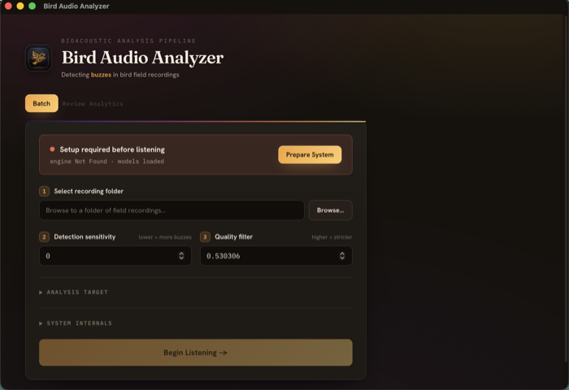

# Installing Bird Audio Analyzer

This guide is for researchers and field staff. No programming tools are needed: you download one installer, open it, and click **Prepare System** once.

If you want to run the app from its source code or change it, read the [developer guide](developer-guide.md) instead.

## Table of contents

1. [What you need](#1-what-you-need)
2. [Download the installer](#2-download-the-installer)
3. [Install on macOS](#3-install-on-macos)
4. [Install on Windows](#4-install-on-windows)
5. [Install on Linux](#5-install-on-linux)
6. [First launch: Prepare System](#6-first-launch-prepare-system)
7. [Where the app keeps its files](#7-where-the-app-keeps-its-files)
8. [Updating](#8-updating)
9. [Uninstalling](#9-uninstalling)
10. [Troubleshooting](#10-troubleshooting)

---

## 1. What you need

| Item | Notes |
|---|---|
| A computer | An Apple Silicon MacBook (M1 or later) is the fastest. Windows and Linux PCs work; NVIDIA GPUs are used automatically; without a GPU processing is slower but complete. |
| About 4 GB of free disk space | The app itself is about 100 MB. On first launch it downloads the analysis engine (PyTorch and related packages), about 2 GB. |
| An internet connection for the first launch | Only needed once, for the engine download. Analysis itself runs entirely on your computer; recordings never leave it. |
| Your recordings | A folder of `.wav`, `.flac` or `.mp3` files recorded at 48 kHz (AudioMoth default). Subfolders are included. |

---

## 2. Download the installer

Open the [releases page](https://github.com/Human-Augment-Analytics/bird-audio/releases/latest) and download the file for your computer:

| Computer | File to download |
|---|---|
| Mac with Apple Silicon (M1, M2, M3, M4) | `Bird.Audio.Analyzer_<version>_aarch64.dmg` |
| Windows 10 or 11 | `Bird.Audio.Analyzer_<version>_x64-setup.exe` |
| Ubuntu or Debian Linux | `Bird.Audio.Analyzer_<version>_amd64.deb` |
| Other Linux | `Bird.Audio.Analyzer_<version>_amd64.AppImage` |

Not sure whether your Mac has Apple Silicon? Click the Apple menu, then **About This Mac**. The **Chip** line says "Apple M1" or later. Intel Macs are not supported by the current installers.

---

## 3. Install on macOS

1. Open the downloaded `.dmg` file.
2. Drag **Bird Audio Analyzer** onto the **Applications** folder shown in the same window.
3. Open your **Applications** folder and double-click **Bird Audio Analyzer**.

The first time, macOS will refuse with a message that it "could not verify" the app or that the app "cannot be opened". This is expected: the app is not signed with an Apple developer certificate. Allow it once:

1. Click **Done** (or **Cancel**) on the message.
2. Open **System Settings**, then **Privacy & Security**.
3. Scroll down to the **Security** section. A line says *"Bird Audio Analyzer" was blocked to protect your Mac*. Click **Open Anyway**.
4. Confirm with your password or Touch ID, then click **Open** in the final dialog.

macOS remembers the decision. Later launches open normally from the Applications folder, the Dock or Spotlight.

> On macOS 13 and 14 you can instead right-click the app, choose **Open**, and click **Open** in the dialog.

---

## 4. Install on Windows

1. Double-click the downloaded `Bird.Audio.Analyzer_<version>_x64-setup.exe`.
2. If a blue **Windows protected your PC** box appears, click **More info**, then **Run anyway**. The installer is not signed with a Microsoft certificate, so SmartScreen shows this once.
3. Follow the installer. It adds a Start-menu entry and a desktop shortcut.
4. Launch **Bird Audio Analyzer** from the Start menu.

---

## 5. Install on Linux

**Ubuntu or Debian (`.deb`)**

```bash
sudo apt install ./Bird.Audio.Analyzer_<version>_amd64.deb
```

Then launch *Bird Audio Analyzer* from your application menu.

**Any distribution (`.AppImage`)**

```bash
chmod +x Bird.Audio.Analyzer_<version>_amd64.AppImage
./Bird.Audio.Analyzer_<version>_amd64.AppImage
```

---

## 6. First launch: Prepare System



When the app opens, the panel at the top of the **Batch** tab runs a health check. On a fresh computer it reads **Setup required before listening** with a **Prepare System** button.

1. Click **Prepare System**.
2. Wait. The app downloads the analysis engine (about 2 GB) into its own private folder. This takes anywhere from one to fifteen minutes depending on your connection. The button shows *Preparing…* while it works, and the window stays responsive.
3. When it finishes the panel turns green: **Instrument ready to listen**, with the compute device it found. **Graphics Card (Accelerated)** means an Apple Silicon or NVIDIA GPU will be used. **Processor (CPU)** means analysis will run on the CPU, which is slower but produces identical results.

You only do this once. The engine stays installed across app updates.

If Prepare System fails, the error message names the cause. The most common one is no internet access, or a corporate network that blocks downloads from `pypi.org` or `github.com`. Connect to another network and click **Prepare System** again.

You are now ready for the [first analysis tutorial](tutorial-first-analysis.md).

---

## 7. Where the app keeps its files

| What | Where |
|---|---|
| Analysis results for a folder of recordings | A file called `batch.db` inside that folder. Copy or back up the folder and the results travel with it. |
| The analysis engine and detector models | A private app folder. macOS: `~/Library/Application Support/com.bird.audioanalyzer/runtime`. Windows: `%APPDATA%\com.bird.audioanalyzer\runtime`. Linux: `~/.local/share/com.bird.audioanalyzer/runtime`. |
| Exports (CSV, JSON, Raven, warbleR) | Wherever you choose when you click Export. |

The app never modifies your recordings.

---

## 8. Updating

Download the new installer from the releases page and install it over the old one, the same way as the first time (macOS: drag to Applications and choose **Replace**). The app refreshes its private engine folder on the next launch. Existing `batch.db` files remain readable; if the detector or pipeline changed, re-running a folder starts a new session rather than mixing old and new results (see [Resuming and re-running](tutorial-resume-rerun.md)).

---

## 9. Uninstalling

- **macOS:** drag *Bird Audio Analyzer* from Applications to the Trash. To also remove the engine, delete `~/Library/Application Support/com.bird.audioanalyzer`.
- **Windows:** Settings, then Apps, then *Bird Audio Analyzer*, then Uninstall. Delete `%APPDATA%\com.bird.audioanalyzer` to remove the engine.
- **Linux:** `sudo apt remove bird-audio-analyzer`, or delete the AppImage. Delete `~/.local/share/com.bird.audioanalyzer` to remove the engine.

Results (`batch.db`) stay in your recording folders until you delete them yourself.

---

## 10. Troubleshooting

| Symptom | Fix |
|---|---|
| macOS: "cannot be opened because the developer cannot be verified" or "could not verify" | Follow the **Open Anyway** steps in [section 3](#3-install-on-macos). |
| macOS: "is damaged and can't be opened" | The download was quarantined. Open **Terminal** and run `xattr -dr com.apple.quarantine "/Applications/Bird Audio Analyzer.app"`, then open the app again. |
| Windows: "Windows protected your PC" | Click **More info**, then **Run anyway**. |
| Prepare System never turns green | Check the internet connection and retry. If the error mentions a proxy or certificate, ask your IT team to allow `pypi.org`, `files.pythonhosted.org` and `github.com`. |
| Health panel says **Processor (CPU)** on an Apple Silicon Mac | Make sure you downloaded the `aarch64` (Apple Silicon) installer, not an Intel build. |
| Health panel says models missing | The installer was incomplete. Download it again from the releases page. |
| The app opens but a run fails on every file | Open the **System internals** section on the Batch tab and check the device; try switching to CPU. If it still fails, report the error text shown for a file on the [issue tracker](https://github.com/Human-Augment-Analytics/bird-audio/issues). |
