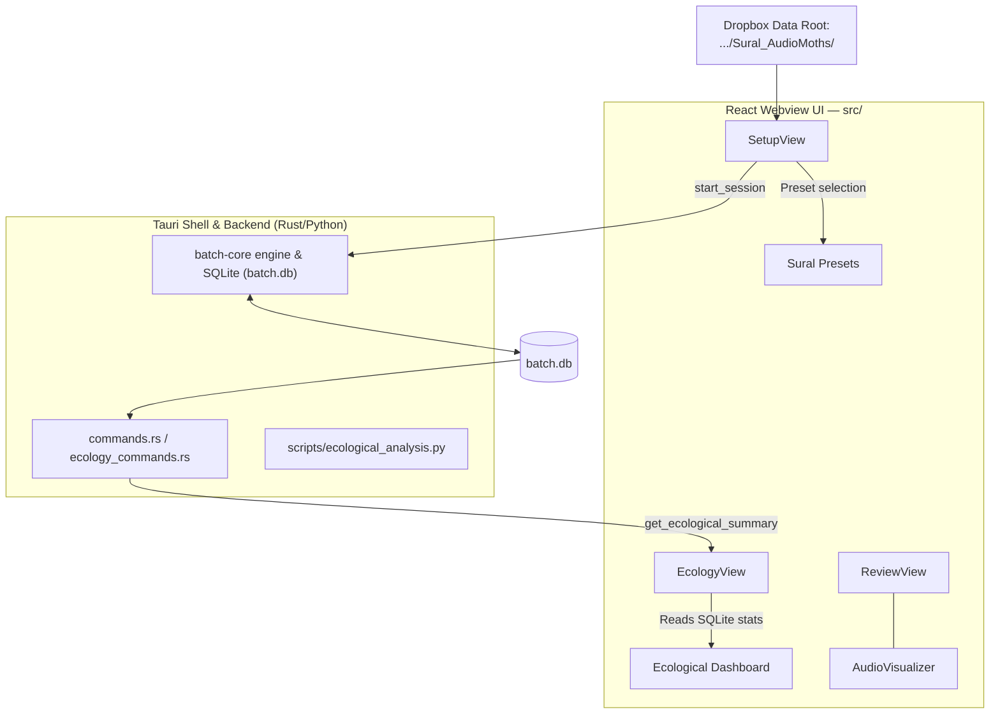

# Sural AudioMoth Stakeholder Workflow & Ecological Dashboard Design

**Date:** 2026-08-02  
**Target Branch:** `leyang/research-directions`  
**Goal:** Make the Bird Audio Analyzer seamless and high-value for stakeholders processing the 11,137-file **Sural AudioMoths dataset** (`/Users/leyangloh/Library/CloudStorage/Dropbox-GaTech/Le Yang Loh/Sural_AudioMoths`).

---

## 1. Overview & Purpose

The Bird Audio Analyzer processes field recordings to localize and curate Hume's Leaf Warbler (*Phylloscopus humei*) "buzz" vocalizations. This design equips the app with:
1. **Automatic AudioMoth Metadata Ingestion:** Parsing `recorder_id` (`PSL*`, `PSM*`, `PSH*`), `elevation_band` (`Low`, `Medium`, `High`), and `recording_datetime` directly from AudioMoth file paths and filenames.
2. **Sural Dataset Quick-Presets:** A 1-click preset selector in the GUI pointing directly to the local Sural AudioMoths Dropbox dataset directories.
3. **In-App Ecological Summary Dashboard:** A dedicated interactive dashboard surfacing effort-normalized calling rates (buzzes/hour), call duration distributions by elevation band, completeness quality ratios, and 1-click export of analysis-ready tables.

---

## 2. Technical Architecture & Components

### Component Details

#### Component 1: AudioMoth Metadata Auto-Parsing
- **Path / Filename Recognition:**
  - `recorder_id`: Matches pattern `(PSL\d+|PSM\d+|PSH\d+|H\d+)` from folder name or file stem.
  - `elevation_band`: Automatically mapped from prefix (`PSL*` -> `Low`, `PSM*` -> `Medium`, `PSH*`/`H*` -> `High`).
  - `recording_datetime`: Parsed from AudioMoth filename format `YYYYMMDD_HHMMSS` (e.g. `20250619_080000`).
- **Database Schema Storage:**
  - File and Event rows stored in `batch.db` will populate `recorder_id`, `elevation_band`, and `recording_datetime`.
  - CSV/JSON exports automatically include these columns.

#### Component 2: Sural Dataset Presets in GUI (`SetupView.tsx`)
- **Quick Preset Selector:**
  - *Sural 2025 Low Elevation* (`.../Sural_AudioMoths/2025/Low`)
  - *Sural 2025 Mid Elevation* (`.../Sural_AudioMoths/2025/Mid`)
  - *Sural 2025 High Elevation* (`.../Sural_AudioMoths/2025/High`)
  - *Sural 2024 Dataset Root* (`.../Sural_AudioMoths`)
- Clicking a preset automatically populates the input folder path and verifies directory existence.

#### Component 3: In-App Ecological Summary Dashboard (`EcologyView.tsx`)
- **Tauri Command:** `get_ecological_summary(session_id: Option<i64>)`
  - Invokes `scripts/ecological_analysis.py` or computes direct SQLite aggregates from `batch.db`.
- **Metrics & Visualizations:**
  1. **Effort Accounting:** Total AudioMoth recording hours (0.25h per 15-min WAV file).
  2. **Calling Rate (Buzzes/Hour):** Effort-normalized detection rates per elevation band (Low vs. Medium vs. High).
  3. **Call Duration Metrics:** Mean and median call duration (seconds) per elevation band.
  4. **Quality / Completeness Ratio:** Percentage of detections passing the Stage B completeness gate ($\theta_B = 0.530306$).
  5. **Export Action:** 1-Click "Export Ecological Summary CSV" for R / Python GLMs.

---

## 3. Data Flow & Execution

1. User selects a Sural Preset or custom folder in **Setup Mode**.
2. **Batch Core Engine** runs inference across AudioMoth files, populating `batch.db`.
3. User navigates to **Ecology Dashboard** tab or **Review Mode**.
4. **Ecology Dashboard** fetches summarized effort-normalized rates and duration metrics, rendering responsive charts.
5. User can export curated ecological tables or step into **Review Mode** to confirm/reject detections on the spectrogram.

---

## 4. Verification & Self-Review

- **Placeholder Scan:** No TBD/TODO markers.
- **Consistency:** Aligns with existing SQLite schema in `batch-core/src/store.rs` and `scripts/ecological_analysis.py`.
- **Scope Check:** Focused strictly on stakeholder usability with the local Sural AudioMoth dataset.
