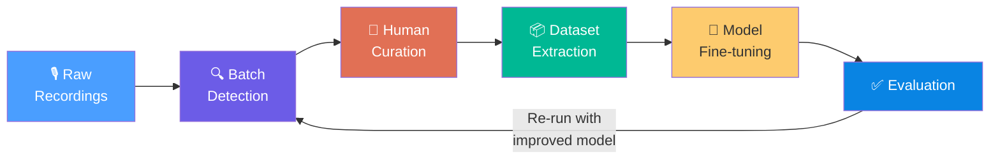

# Tutorial: Active Learning — Adapting the Model to Your Data

This tutorial walks you through the **complete active learning cycle** — from curated detections to an improved YOLO model fine-tuned for your specific field site. You'll learn not just *how* to run each tool, but *when* and *why* each step matters.

> **Prerequisites**: You should be comfortable running batch detection and using Review mode to confirm/reject events. See [First Analysis Tutorial](tutorial-first-analysis.md) for basics. For a complete CLI reference of every script mentioned here, see the [Advanced Features Reference](advanced-search-active-learning.md).

---

## 1. The Active Learning Loop

Your model was trained on a specific dataset. Your field site has different noise profiles, different recording equipment, different background species. **Active learning adapts the model to YOUR data.**

The cycle looks like this:



Each loop through this cycle teaches the model about your site's specific challenges — the local noise floor, co-occurring species, equipment artifacts, and the particular acoustic variants of Hume's Leaf Warbler calls present in your recordings.

> [!IMPORTANT]
> You don't need to do the full cycle in one sitting. The database (`batch.db`) persists all your curation decisions, so you can curate events over several days and extract the dataset when you're ready.

---

## 2. When to Use Active Learning

Before investing time in the cycle, ask yourself whether it will actually help. Use this decision framework:

| Situation | Should You Fine-Tune? | Why |
|---|---|---|
| False positive rate > 20% | ✅ **Yes** | The model is triggering on local noise/species it wasn't trained against |
| Model misses calls you can clearly see in spectrograms | ✅ **Yes** | Your site's calls may differ from the training distribution |
| Deploying to a new geographic region | ✅ **Essential** | Different subspecies, equipment, and noise profiles |
| Model works great as-is (>90% precision and recall) | ❌ **Don't bother** | You'll just overfit to a small sample and may degrade performance |

> [!TIP]
> A quick way to estimate your false positive rate: run batch detection on a representative recording, then review **all** events. If you're rejecting more than 1 in 5, active learning will help.

---

## 3. Step 1: Build a Quality Curation Set

The quality of your fine-tuning depends entirely on the quality of your curation. Garbage in, garbage out.

### How Many Events to Curate

As a rule of thumb, aim for:

- **100+ confirmed events** (`retained = 1`) — real buzz calls you're confident about
- **50+ rejected events** (`retained = 0`) — false positives the model got wrong

More is always better, but diminishing returns kick in around 300 total events for a single-site deployment.

### What Makes a Good Training Example

**Use clear, unambiguous cases:**
- Calls that are clearly visible in the spectrogram
- Rejections that are obviously *not* calls (noise, other species, equipment artifacts)

**Avoid borderline cases:**
- Faint calls that even an expert would debate
- Overlapping calls that are hard to separate
- Partially clipped events at file boundaries

> [!WARNING]
> Including ambiguous cases in your training set teaches the model to be uncertain. That uncertainty compounds — the next iteration will produce *more* borderline detections, not fewer.

### Using Review Mode Effectively

1. Run batch detection on your target recordings
2. Open the results in **Review mode**
3. Work through events systematically — don't cherry-pick
4. For each event, ask: *"Am I confident this is / is not a real call?"*
   - If yes → confirm or reject it
   - If unsure → **skip it** (leave `retained` as `NULL`)

Only confirmed (`retained = 1`) and rejected (`retained = 0`) events are used for dataset extraction. Skipped events are ignored, so it's safe to leave uncertain cases unreviewed.

---

## 4. Step 2: PCEN Preprocessing (Optional but Recommended)

Per-Channel Energy Normalization (PCEN) is a modern alternative to standard dB spectrograms that handles noisy field conditions better. Before building your dataset, it's worth checking whether PCEN would improve things.

### When PCEN Helps

- **Noisy sites** — streams, roads, constant insect chorus
- **Variable background** — recordings spanning dawn to midday
- **Rain or wind** — broadband noise that masks calls
- **Constant-frequency interferers** — electronic hums, cicadas

### Running the Comparison

Pick a representative audio file and generate a side-by-side comparison:

```bash
uv run python scripts/pcen_preprocessor.py \
  --input data/example.WAV \
  --offset 10.0 \
  --duration 10.0
```

This saves a comparison plot to `output/pcen_comparison.png`.

### What to Look For

Open the comparison image and compare the two spectrograms:

- **Top panel**: Standard dB spectrogram
- **Bottom panel**: PCEN spectrogram (with bioacoustic-tuned parameters)

> [!TIP]
> If the PCEN spectrogram shows **clearer separation between buzz calls and the background noise floor**, consider using PCEN-processed spectrograms for your fine-tuning dataset. If both look similar, standard dB is fine — PCEN adds complexity without benefit when noise levels are already low.

The script uses parameters optimized for transient bird calls: `gain=0.98`, `bias=2.0`, `power=0.5`, `b=0.035`. You can adjust these via CLI flags — see the [Advanced Features Reference](advanced-search-active-learning.md) for all options.

---

## 5. Step 3: Extract the Fine-Tuning Dataset

This is where your curation decisions become training data. The `active_learning.py` script reads your database, extracts spectrogram images and YOLO-format labels, and produces a ready-to-train dataset.

### What Gets Extracted

The script queries `batch.db` and selects two categories of events:

| Category | Database Criteria | What It Teaches the Model |
|---|---|---|
| **Positive samples** | `retained = 1` | What real buzz calls look like |
| **Negative samples** | `retained = 0` AND `stage_a_conf >= threshold` | What false alarms look like — **these are the most valuable training examples** because they're the cases where the model was most confident but most wrong |

For each selected event, the script:
1. Centers a 2.75-second window around the event (matching the YOLO model's input format)
2. Extracts the audio clip and computes the cropped dB spectrogram
3. For positives: generates YOLO bounding-box annotations (normalized `class x_center y_center width height`)
4. For negatives: writes an **empty label file** — this teaches the model "this looks like a detection, but it isn't"

### Running the Extraction

```bash
uv run python scripts/active_learning.py \
  --db data/batch.db \
  --dataset-dir output/dataset_active_learning \
  --min-stage-a-conf 0.5
```

The `--min-stage-a-conf` parameter controls which rejected events become negative training samples. Setting it to `0.5` means: *"Only include false positives where the model was ≥50% confident."* These high-confidence false positives are the cases where the model was most wrong — and therefore the most informative corrections.

> [!TIP]
> If you have very few rejected events, lower `--min-stage-a-conf` to `0.3` to include more negative examples. If you have thousands, raise it to `0.7` to focus on the worst offenders.

### Output Directory Structure

```
output/dataset_active_learning/
├── dataset.yaml          ← YOLO dataset config (points to images/ and labels/)
├── audio/
│   ├── event_00001.wav   ← Raw audio clips (for reference/debugging)
│   └── ...
├── images/
│   ├── event_00001.png   ← Spectrogram images (model input)
│   └── ...
└── labels/
    ├── event_00001.txt   ← YOLO annotation (bounding boxes or empty)
    └── ...
```

### Verifying the Dataset

Before training, **always spot-check your dataset**:

1. Open a few images from `images/` — do they look like reasonable spectrograms?
2. For confirmed events, open the corresponding `.txt` file in `labels/` — it should contain one or more lines like `0 0.523 0.450 0.082 0.310`
3. For rejected events, the `.txt` file should be **empty** (zero bytes)
4. Check `dataset.yaml` — it should reference the correct absolute paths

> [!WARNING]
> If label files contain bounding boxes for events you rejected (or are empty for events you confirmed), something went wrong with the database query. Check that your `batch.db` reflects your most recent curation session.

### Filtering by Session

If you've run multiple batch sessions, you can extract data from just one:

```bash
uv run python scripts/active_learning.py \
  --db data/batch.db \
  --session-id 3 \
  --dataset-dir output/dataset_session_3
```

---

## 6. Step 4: Query-by-Example — Finding What the Model Missed

Before training, you can use Query-by-Example (QBE) to discover potential **false negatives** — real calls the model missed entirely. These are invisible to the active learning extraction (which only works with detected events), but QBE can surface them.

### The Concept

You pick a confirmed buzz call that you know is real. QBE then searches all other events in the session for ones with similar acoustic features — similar spectrogram shape, similar spectral timbre, similar duration. If it finds unreviewed events with high similarity, those are likely real calls the model missed.

### Running QBE

Find the database ID of a good confirmed event (shown in Review mode), then:

```bash
uv run python scripts/query_by_example.py \
  --query-id 42 \
  --k 10
```

This searches the same session and returns the 10 most similar events, with output like:

```
Top-10 matches for Query Event 42:
Rank  | Event ID | Sim    | Retained | File                      | Time Range      | Freq Range
-----------------------------------------------------------------------------------------------------
1     | 87       | 0.9512 | 1        | 20250611_080000.WAV       | 34.20-34.45s    | 4200-7800Hz
2     | 156      | 0.9103 | None     | 20250611_083000.WAV       | 12.10-12.38s    | 4100-7600Hz
3     | 203      | 0.8744 | 0        | 20250611_090000.WAV       | 45.60-45.82s    | 4300-7900Hz
...
```

### Interpreting Similarity Scores

| Score Range | Interpretation |
|---|---|
| > 0.90 | Very similar — almost certainly the same type of event |
| 0.70 – 0.90 | Somewhat similar — worth reviewing |
| < 0.70 | Probably different — likely a different call type or noise |

### Feature Types

The `--feature-type` flag controls what acoustic properties QBE compares:

| Feature Type | Best For |
|---|---|
| `combined` (default) | General use — balances shape and timbre. Start here. |
| `spectrogram` | Calls with distinctive visual shapes (e.g., frequency sweeps, harmonics) |
| `mfcc` | Calls with distinctive timbral qualities, even if their spectrogram shapes vary |

### Practical Workflow

1. **Pick 3–5 of your best confirmed events** — clear, strong, unambiguous calls
2. **Run QBE on each** with `--k 10` or `--k 20`
3. **Look at results with `Retained = None`** — these are unreviewed events
4. **If they have high similarity (>0.85), go review them** — they're likely real calls the model missed
5. **If you confirm new events, re-run the dataset extraction** (Step 3) to include them

> [!TIP]
> QBE caches computed feature embeddings in `output/` as `.npz` files. The first run on a session may take a minute; subsequent searches are near-instant. Use `--recache` if you've added new events to the session.

---

## 7. Step 5: Fine-Tune the Model

With your dataset extracted and verified, you're ready to fine-tune the YOLO localizer.

### Before You Start

> [!CAUTION]
> **Back up your original model before overwriting it.** Copy `models/buzz_localizer.pt` to `models/buzz_localizer_original.pt` (or similar). If fine-tuning goes wrong, you'll need the original to roll back.

```bash
cp models/buzz_localizer.pt models/buzz_localizer_backup_$(date +%Y%m%d).pt
```

### Train/Validation Split

**Never train on everything.** You need a held-out validation set to detect overfitting.

A simple approach: split your dataset 80/20 before training. You can do this by manually moving ~20% of the image/label pairs into a separate `val/` directory, or by modifying `dataset.yaml` to point `train:` and `val:` at separate directories.

### Running Fine-Tuning

Using the [Ultralytics YOLO CLI](https://docs.ultralytics.com/modes/train/):

```bash
yolo detect train \
  data=output/dataset_active_learning/dataset.yaml \
  model=models/buzz_localizer.pt \
  epochs=50 \
  imgsz=288 \
  batch=16 \
  lr0=0.001 \
  freeze=10
```

Key parameters:

| Parameter | Value | Rationale |
|---|---|---|
| `model` | Your current model | Start from existing weights, don't train from scratch |
| `epochs` | 50 | Enough for convergence on a small dataset; monitor val loss |
| `imgsz` | 288 | Must match the model's expected input size |
| `lr0` | 0.001 | Lower learning rate for fine-tuning (default 0.01 is too aggressive) |
| `freeze` | 10 | Freeze early layers to preserve general features; only adapt later layers |

> [!IMPORTANT]
> Watch the validation loss during training. If it starts rising while training loss keeps falling, you're overfitting. Stop early and use the best checkpoint.

### After Training

The fine-tuned model will be saved under `runs/detect/train/weights/best.pt`. Copy it to your models directory:

```bash
cp runs/detect/train/weights/best.pt models/buzz_localizer.pt
```

---

## 8. Step 6: Evaluate the Improved Model

A new model is only better if the numbers prove it. Don't skip evaluation.

### Re-Run Batch Detection

Run the same batch on the **same recordings** using the new model:

1. Select the same input files/directory you originally processed
2. Run batch detection with default settings
3. Note the summary statistics: total events detected, confidence distribution

### Compare Results

Look for these signals:

| Metric | Good Sign | Bad Sign |
|---|---|---|
| Events detected | Roughly the same or slightly more | Dramatically more (false positives increased) |
| Average confidence | Higher for real calls | Lower overall (model became uncertain) |
| False positive rate | Lower — fewer rejections needed in Review | Higher — more noise getting through |
| Missed calls | Fewer — events you previously missed now appear | More — model forgot what it knew |

### Spot-Check in Review Mode

Open the new results in Review mode and check:

- Do the **new detections** (ones the old model missed) look like real calls?
- Are the **old false positives** gone, or are they still triggering?
- Did any **previously detected real calls** disappear?

### What If It Got Worse?

| Problem | Likely Cause | Fix |
|---|---|---|
| More false positives than before | Too few negative examples in training | Go back to Step 3 — curate more rejections, lower `--min-stage-a-conf` |
| Model "forgot" previously good detections | Overtrained on a small dataset | Use more `epochs` with a lower `lr0`, or increase `freeze` to preserve more layers |
| Performance is identical | Dataset too small or too similar to original training data | Curate more diverse examples from different recordings/conditions |

---

## 9. Common Pitfalls

### ❌ Overfitting to One Site
If you fine-tune only on recordings from Site A, the model may degrade on Site B. Whenever possible, include data from multiple sites and conditions in your fine-tuning set.

### ❌ Too Few Negative Examples
A model trained mostly on positives learns to detect *everything*. Aim for at least a 2:1 ratio of positives to negatives — but 1:1 is even better. The high-confidence false positives (where `stage_a_conf` was high but `retained = 0`) are your most informative training examples.

### ❌ Curating Ambiguous Cases
If you wouldn't bet money that an event is a real call (or isn't), **skip it**. Training on uncertain labels injects noise into the model's objective function. It's better to have 100 clean examples than 300 noisy ones.

### ❌ Forgetting to Back Up the Original Model
Fine-tuning overwrites the model's weights. If the new model is worse, you need the original to recover. **Always copy the model before training.**

### ❌ Skipping Validation
Training loss going down doesn't mean the model is getting better — it may be memorizing your training set. Always hold out a validation split and monitor validation metrics.

### ❌ Running Only One Cycle
Active learning is iterative by design. The first fine-tuning rarely achieves optimal results. Each cycle surfaces new failure modes that the next round of curation can address. Plan for 2–3 cycles minimum.

---

## Quick Reference: Commands at a Glance

```bash
# 1. PCEN comparison (optional — check if PCEN helps your recordings)
uv run python scripts/pcen_preprocessor.py \
  --input data/example.WAV --offset 10.0 --duration 10.0

# 2. Extract fine-tuning dataset from curated results
uv run python scripts/active_learning.py \
  --db data/batch.db \
  --dataset-dir output/dataset_active_learning \
  --min-stage-a-conf 0.5

# 3. Query-by-example to find missed calls
uv run python scripts/query_by_example.py \
  --query-id 42 --k 10

# 4. Back up the current model
cp models/buzz_localizer.pt models/buzz_localizer_backup_$(date +%Y%m%d).pt

# 5. Fine-tune YOLO
yolo detect train \
  data=output/dataset_active_learning/dataset.yaml \
  model=models/buzz_localizer.pt \
  epochs=50 imgsz=288 batch=16 lr0=0.001 freeze=10

# 6. Deploy the fine-tuned model
cp runs/detect/train/weights/best.pt models/buzz_localizer.pt
```

---

## Further Reading

- [Advanced Features Reference](advanced-search-active-learning.md) — Complete CLI arguments for all scripts
- [First Analysis Tutorial](tutorial-first-analysis.md) — Batch detection and Review mode basics
- [Ultralytics YOLO Training Docs](https://docs.ultralytics.com/modes/train/) — Full YOLO training configuration
- [PCEN Paper (Wang et al. 2017)](https://arxiv.org/abs/1607.05666) — The theory behind Per-Channel Energy Normalization
