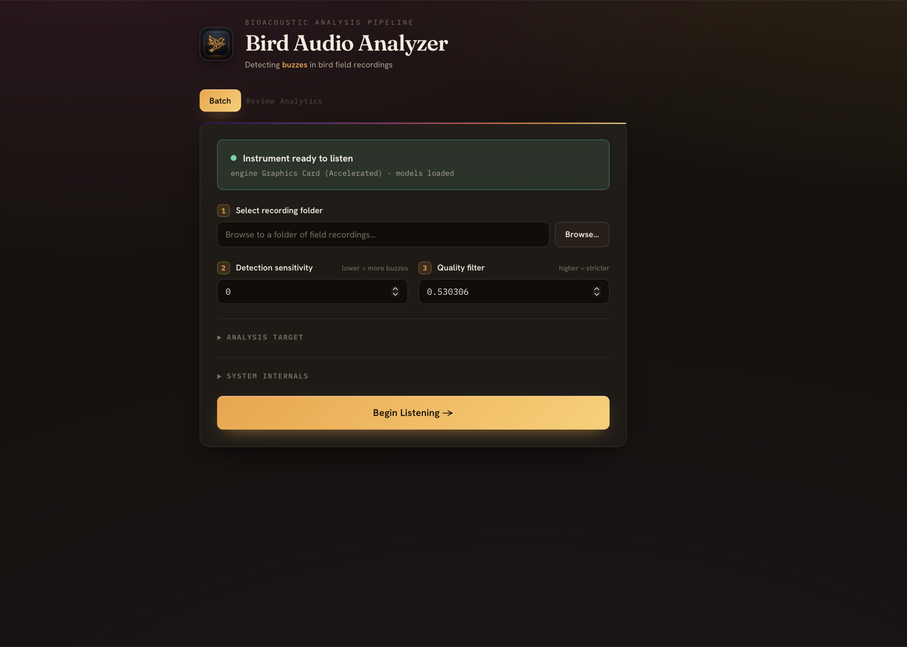
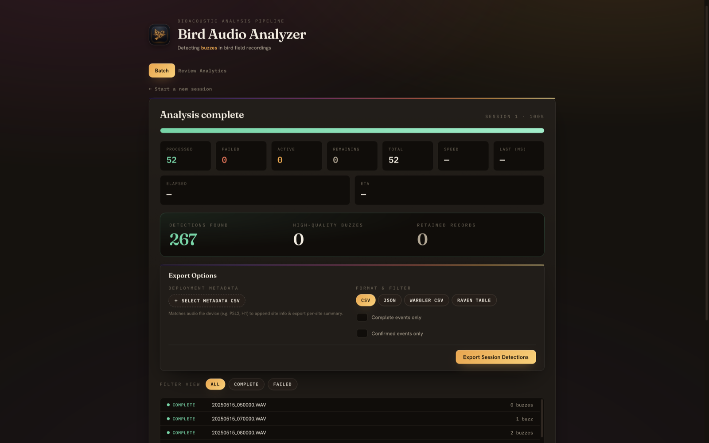
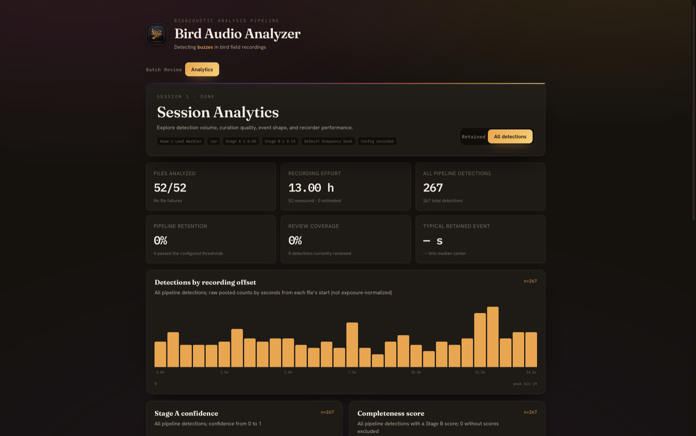
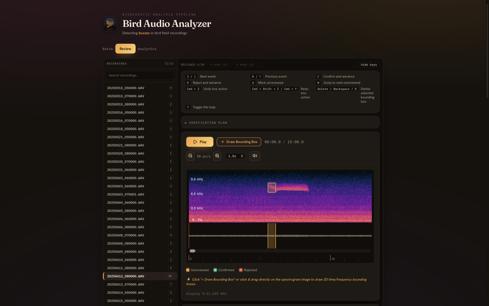
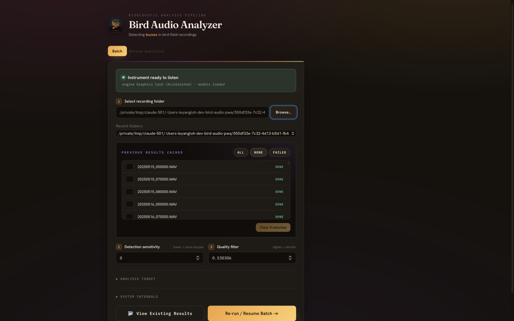

# Tutorial: Your First Analysis Session

A guided walkthrough from opening Bird Audio Analyzer to holding a clean, exported dataset of verified Hume's Leaf Warbler buzz calls.

---

## Table of Contents

1. [Before You Start](#1-before-you-start)
2. [Launching the App & Health Check](#2-launching-the-app--health-check)
3. [Setting Up Your First Batch](#3-setting-up-your-first-batch)
4. [Running the Batch](#4-running-the-batch)
5. [Interpreting the Analytics Tab](#5-interpreting-the-analytics-tab)
6. [Your First Review Session](#6-your-first-review-session)
7. [Exporting Your Clean Dataset](#7-exporting-your-clean-dataset)
8. [What's in Your Export?](#8-whats-in-your-export)
9. [Tips for Your Next Run](#9-tips-for-your-next-run)

---

## 1. Before You Start

### What you'll need

- **The app installed.** Follow [Installing Bird Audio Analyzer](install.md): download the installer for your computer, open it, and click **Prepare System** once. No programming tools are involved.
- **A folder of field recordings.** Any mix of `.wav`, `.flac` and `.mp3` files recorded at 48 kHz (the AudioMoth default). For this walkthrough, a small folder of 5–15 recordings, each 1–15 minutes long, is ideal: enough to see real results without a long wait.

You do not need to know anything about machine learning, Python, or the command line. If you can pick a folder and click a button, you can run this analysis.

### What you'll accomplish

By the end of this tutorial, you will have:

- ✅ Run the two-stage detector over a folder of recordings
- ✅ Understood the Analytics tab that sanity-checks your results
- ✅ Manually reviewed and curated a set of detections on the spectrogram
- ✅ Exported a clean, analysis-ready CSV (or JSON, warbleR, or Raven format) of verified buzz calls

### Expected time

| Step | Time |
|---|---|
| Launch and health check | under a minute (plus the one-time Prepare System download on a new computer) |
| Batch processing (10 fifteen-minute files, Apple Silicon or NVIDIA GPU) | ~2–3 minutes |
| Batch processing (10 fifteen-minute files, CPU only) | ~15–25 minutes |
| Review and curation | ~10 minutes for a first pass |
| Export | ~1 minute |

**Total: about 20 minutes** for a small folder on a laptop with a GPU, or about 40 minutes on CPU.

---

## 2. Launching the App & Health Check

### Start the app

Open **Bird Audio Analyzer** from your Applications folder (macOS), Start menu (Windows) or application menu (Linux). The window opens on the **Batch** tab.



### The health check

The app automatically runs a **health check** when it opens. It verifies three things:

1. **Analysis engine** — is the machine-learning engine installed?
2. **Model files** — are the two detector models present? (They ship inside the app.)
3. **Compute device** — what hardware is available for inference?

If the panel is green, **Instrument ready to listen**, you're ready to go. If it is red, **Setup required before listening**, click **Prepare System**.

### What "Prepare System" does

On a new computer the engine is not installed yet. **Prepare System** downloads it (about 2 GB) into the app's own private folder. This takes one to fifteen minutes depending on your connection; the button shows *Preparing…* while it works. When it finishes the panel turns green.

> 💡 **Tip:** You only do this once. The engine stays installed when you update the app. Nothing is installed anywhere else on your computer.

### The device indicator

The health check auto-detects the best available compute device, in this priority order:

| Shown as | What it means |
|---|---|
| **Graphics Card (Accelerated)** on a Mac | Apple Silicon GPU (M1/M2/M3/M4). A 15-minute recording takes about 13 seconds on an M3 Pro. |
| **Graphics Card (Accelerated)** on a PC | NVIDIA GPU with CUDA. Similar or faster. |
| **Processor (CPU)** | No supported GPU. Slower, about two minutes per 15-minute recording, but the results are identical. |

> ⚠️ **If you expected a GPU but see "Processor (CPU)":** on a Mac, make sure you installed the Apple Silicon (`aarch64`) build. On a PC, check that the NVIDIA driver is current. The app still works on CPU; it's just slower.

---

## 3. Setting Up Your First Batch

With the health check green, you're looking at the **Setup view**. This is where you configure what to analyze and how sensitive the detector should be.


### Choose your input folder

Click **Browse…** and navigate to the folder containing your field recordings. The pipeline will recursively scan all subfolders, so you can point it at a top-level directory for an entire survey. Folders you have analysed before are offered in a **Recent folders** list.

**Supported file types:** `.wav`, `.flac`, `.mp3`

> 💡 **Tip:** For your first run, pick a small, representative folder. You want enough files to see interesting patterns (5–15 files), but not so many that you're waiting an hour. You can always process more folders later.

### Where results go

The app creates a single SQLite database — `batch.db` — inside the recording folder you selected. This file is your durable source of truth: every detection, every curation decision, every session parameter lives here. Point the app at the same folder later and it finds the database again.

> 💡 **Tip:** If you're analyzing multiple surveys, keep them in separate folders so their databases don't mix.

### Understanding the thresholds

This is the part that trips up newcomers, but it's simpler than it looks. There are two knobs, and they control two different things:

#### θ_A — Detection Sensitivity (default: 0.0)

**"How much does something need to look like a buzz for us to consider it?"**

- θ_A is a floor on the **detection confidence** from Stage A (the YOLO object detector).
- At the default of **0.0**, every consolidated detection is included — the detector shows you *everything* it found.
- Raising θ_A (e.g., to 0.3 or 0.5) means only high-confidence detections make it through, which reduces false positives but may miss faint or atypical calls.

**For your first run, keep it at 0.0.** You want to see what the detector is finding before you start filtering things out.

#### θ_B — Quality Filter (default: 0.530306)

**"How clean and complete does a buzz need to be to count?"**

- θ_B is a threshold on the **completeness score** from Stage B (the quality classifier). This score measures how "fully formed" a detected buzz is — was it a clear, complete call, or was it clipped, faint, or overlapping with noise?
- The default of **0.530306** is the operating point validated in the research paper. It balances recall and precision well for most field conditions.
- **Raising** θ_B (e.g., to 0.7 or 0.8) keeps only the cleanest, most textbook buzzes — great for a high-confidence dataset, but you'll miss partial or quieter calls.
- **Lowering** θ_B (e.g., to 0.3) lets through more borderline events — useful when you want to cast a wide net and curate manually.

#### Decision framework

| Scenario | θ_A | θ_B | Why |
|---|---|---|---|
| **First run / exploring a new site** | 0.0 | 0.530306 (default) | See everything; let the validated quality gate do the filtering |
| **You know buzzes are present, want clean data fast** | 0.0 | 0.7+ | Skip borderline events; fewer to review |
| **Low-density site, can't afford to miss any** | 0.0 | 0.3 | Cast a wide net; accept more manual review work |
| **Noisy site, drowning in false positives** | 0.2–0.3 | 0.530306 | Raise the detection floor to cut obvious noise |

**For your first run, use the defaults.** You can always re-run with different thresholds later — the app handles that gracefully.

---

## 4. Running the Batch

Click **Begin Listening** to start the pipeline.

<!-- screenshot: The Run view during active processing, showing a progress bar, clock-time ETA, running counts (files processed: 4/12, n_events: 37, n_complete: 22, n_retained: 22), and the FileTable below listing individual files with their status (done, in_progress, pending). -->

### What the progress screen shows

As the pipeline works through your files, you'll see:

- **Per-file status** — Each file in the `FileTable` shows its current state: `pending`, `in_progress`, `done`, or `failed`
- **ETA** — An estimated time to completion based on processing speed so far
- **Running buzz counts** — Aggregate counts that update as each file finishes

### How long to expect

Processing time depends on your hardware. Measured on a 15-minute, 48 kHz AudioMoth recording:

| Hardware | Per 15-minute recording |
|---|---|
| Apple Silicon (M3 Pro) | ~13 seconds |
| NVIDIA GPU (CUDA) | ~10–20 seconds |
| CPU only | ~2 minutes |

A folder of 10 fifteen-minute field recordings: roughly 2–3 minutes on a GPU, 20 minutes on CPU. Two files are processed at once on Apple Silicon, and all cores but one are used on CPU.

> 💡 **Tip:** You can leave the app running and do other work. If you need to stop, click **Cancel run**; your progress is saved. When you select the same folder again, already-processed files are skipped.

### The three result counts

When the batch completes, you'll see three key numbers:

| Count | Definition | What it tells you |
|---|---|---|
| **n_events** | All consolidated events (no threshold applied) | The raw detector output — "here's everything that looked remotely like a buzz" |
| **n_complete** | Events passing the quality gate (completeness score `q ≥ θ_B`) | How many of those were clean, well-formed calls according to Stage B |
| **n_retained** | Events passing **both** gates (`conf ≥ θ_A` **and** `q ≥ θ_B`) | Your **analysis-ready set** — these are the events that will appear in your export by default |



**Reading these numbers:**

- **n_retained is roughly what you expected?** Great — proceed to review.
- **n_retained = 0 but n_events is high?** Your θ_B is probably too strict for this data. The detector is finding candidates, but Stage B is rejecting them all as incomplete. Lower θ_B and re-run, or jump into Review to inspect the borderline events visually.
- **n_events = 0?** Either there are genuinely no buzz calls in these recordings, or the audio format/quality is preventing detection. Check that your files play correctly and that the recording captures the 5–9 kHz range.
- **n_events is very high (thousands)?** This could mean a noisy site with many false positives, or genuinely high bird activity. The Analytics tab (next section) will help you distinguish.

> ⚠️ **With θ_A at the default of 0.0**, n_complete and n_retained will always be equal — every event that passes the quality gate automatically passes the (non-existent) confidence gate. This is expected and fine for a first run.

---

## 5. Interpreting the Analytics Tab



Once at least one file has finished, the **Analytics** tab becomes available and refreshes as the batch progresses. Use it as your first line of defence against a mis-configured run.

**What to look for:**

- **Typical retained event is ~0.3–0.8 s** with a median centre frequency around 6–7 kHz. Far outside that at one recorder means that site's "detections" are probably a non-buzz sound source.
- **Detections by recording offset** — a single bin with far more events than its neighbours usually marks a transient noise event (wind gust, handling, vehicle), not birds.
- **Rate by elevation band** divides retained detections by measured recording hours. Bands come from the `PSL`/`PSM`/`PSH`/`H` recorder prefix in the file path; other naming conventions land everything in one band.
- **Recorder table** — sort by rate per hour. One recorder far above the rest is either a genuinely active site or a noisy recorder near water, a road, or a fence line. Zero events at a recorder means no birds or a dead unit; check the audio.
- **Data-quality warnings** at the top flag failed files, estimated effort, and unverified inventory. Resolve them before comparing sites.

---

## 6. Your First Review Session

The batch gave you raw ML output. **Review mode** is where you turn that into a verified dataset. Think of it like quality control on a production line — you're confirming the good calls, rejecting the false alarms, and fixing any that the model got almost-but-not-quite right.

Switch to the **Review** tab.



### Picking a file

The file list shows every processed recording with its event count. Click a file to load it. The spectrogram renders with **bounding boxes** drawn over each detected event — these are the buzzes (and candidate buzzes) the ML pipeline found.

> 💡 **Tip:** Start with a file that has a moderate number of events (5–15). Files with too many events can be overwhelming at first; files with zero won't give you anything to practice on.

### Navigating the spectrogram

Before you start judging events, get comfortable with the spectrogram controls:

- **Zoom** — Scroll or pinch to zoom in on the time axis. Zooming in makes it easier to see the fine structure of a buzz.
- **Seek** — Click on the waveform or spectrogram to jump to a specific time position.
- **Playback rate** — Adjust the playback speed. **0.25× is your best friend for fast buzzes** — slowing them down makes the tonal structure audible even on laptop speakers.
- **Play/Pause** — Listen to the audio at the cursor position. Hearing a buzz while looking at it on the spectrogram builds your visual intuition fast.

<!-- screenshot: A zoomed-in spectrogram view showing a single buzz call — a bright, narrow-band signal between roughly 5 and 9 kHz lasting about 0.5 seconds, with a clean bounding box drawn around it. The playback controls are visible at the bottom with speed set to 0.25×. -->

### Confirming a true positive

You see a clean, bright band between roughly 5 and 9 kHz, lasting about 0.5 seconds. The spectral energy is concentrated and shows the characteristic rising frequency sweep of a Hume's Leaf Warbler buzz. This is a textbook detection.

**→ Click Confirm** in the Event Table for this event, or press `C` with the event selected.

The event's `review_status` changes from `unreviewed` to `confirmed`. It will now be included when you export with the "Confirmed only" toggle.

### Rejecting a false positive

You see a bounding box around a broadband noise spike — energy smeared across all frequencies, not concentrated in the 5–9 kHz buzz band. This is wind noise, handling noise, or an insect. It looks nothing like a warbler call on the spectrogram.

**→ Click Reject**, or press `X`.

The event stays in the database (marked `rejected`) but won't appear in your confirmed-only exports. Keeping rejected events is useful — it trains your eye, and if you later use the [Active Learning pipeline](advanced-search-active-learning.md), rejected events become negative training examples.

### Editing bounds

The model got the call right, but the bounding box starts too early — it's including half a second of silence before the actual call onset. Or maybe it's cropped too tight and cuts off the tail end of the buzz.

**→ Drag the left or right edge** of the bounding box on the spectrogram to align it with the actual call boundaries.

The app calls `update_event_bounds` in the background, recomputing `duration` and `center_freq` automatically. You can also drag the top and bottom edges to adjust the frequency extent.

> 💡 **Tip:** Precise bounds matter for downstream analysis — duration and frequency measurements come directly from these boxes. It's worth spending a moment to get them right, especially for events you're confirming.

### Adding a missed call

As you scroll through the spectrogram, you spot a faint but unmistakable buzz that the model missed — maybe it was quiet, or slightly outside the typical frequency range, or overlapping with another sound.

**→ Click Draw Bounding Box**, then drag a box directly on the spectrogram around the missed call.

The app creates a **manual event** with `source = 'manual'` and `review_status = 'confirmed'` — it's automatically confirmed because you, the expert, just identified it. Its completeness is left unresolved rather than guessed. It will appear in your exports alongside the ML-detected events.

### Deleting an event

Occasionally you'll encounter a detection that's so clearly noise that you don't even want it in the database as a rejected event — perhaps the model placed dozens of boxes on a stretch of continuous static.

**→ Click Delete**, or select the box and press `Delete`, to remove the event. Use **Undo** (Cmd/Ctrl+Z) to restore it or **Redo** (Cmd/Ctrl+Shift+Z or Cmd/Ctrl+Y) to reapply the deletion.

> **Prefer rejection for detector errors.** Undo/Redo makes deletion reversible during review, but rejected events remain available for model improvement and error analysis.

### Building your review intuition

Here's the most important tip for your first session:

> 💡 **Tip:** Review at least 20–30 events across several different files before you trust your judgment. The first five will feel uncertain — "is this a buzz or just a noisy patch?" By event twenty, you'll be able to tell at a glance. The key visual signature is a **bright, narrow-band (not broadband) energy concentration between 5–9 kHz**, typically lasting 0.3–0.8 seconds, often with a slight upward frequency sweep.

Curation decisions are **saved to batch.db immediately** and persist across sessions. You can stop reviewing, close the app, and pick up exactly where you left off tomorrow.

For a faster, keyboard-driven workflow and the verification queue, continue with [Reviewing Detections](tutorial-review-curation.md).

---

## 7. Exporting Your Clean Dataset

Once you've reviewed a satisfying number of events (or all of them, if you're thorough), it's time to export your curated dataset. Head to the **Export** controls on the completion card.


### Choosing a format

| Format | File | Best for |
|---|---|---|
| **CSV** | `.csv` | General-purpose analysis — opens in Excel, R, Python (pandas), anything |
| **JSON** | `.json` | Programmatic analysis — easy to parse in scripts, preserves data types |
| **warbleR CSV** | `.csv` | R users working with the [warbleR](https://cran.r-project.org/package=warbleR) package. Columns: `sound.files`, `selec`, `start`, `end`, `bottom.freq`, `top.freq` (frequencies in kHz) |
| **Raven Selection Table** | `.txt` | Users of Cornell's [Raven Pro](https://ravensoundsoftware.com/) bioacoustic software. Tab-separated with Raven-standard columns: `Selection`, `View`, `Channel`, `Begin Time (s)`, `End Time (s)`, `Low Freq (Hz)`, `High Freq (Hz)`, etc. |

> 💡 **Tip:** Not sure which to use? **CSV** is the safest default. You can always re-export in a different format later — the data lives in `batch.db`, not in the export file.

### The "Confirmed only" toggle

- **Off** — Exports all retained events (those passing both θ_A and θ_B), regardless of whether you've reviewed them. This includes events with `review_status` of `unreviewed`, `confirmed`, or `rejected`.
- **On** — Exports **only events marked `confirmed`** (either by you in Review, or automatically for manual events you drew). Rejected and unreviewed events are excluded.

**When to use each:**

- If you've reviewed every event: toggle **on** for your cleanest dataset.
- If you've only reviewed a subset: toggle **off** to include the unreviewed ML detections, then note in your analysis that some events are uncurated.
- For a "quick look" before committing to full review: toggle **off** and filter by `review_status` in your own analysis code.

### Deployment metadata join

If you're running a **multi-site survey** and have a CSV of recorder deployment parameters, this feature enriches your export with spatial metadata.

Your metadata CSV should have these columns:

```csv
device_id,site_id,elevation_m,lat,lon,deploy_date
PSL2,SITE_ALPHA,1200.0,34.567,-112.432,2025-06-10
PSM5,SITE_BETA,1500.0,34.612,-112.501,2025-06-10
```

The app matches `device_id` to recorder prefixes parsed from your filenames (e.g., `PSL2_20250611_080000.WAV` → device `PSL2`). When a match is found:

1. Each event row gets `site_id`, `elevation_m`, `lat`, and `lon` columns joined in.
2. A secondary **site-level summary CSV** (`<your_export>_summary.csv`) is automatically generated with per-site aggregations: `n_events`, `duration_mean`, `duration_median`, `center_freq_mean`, and `effort_hours`. Readable WAV/FLAC/MP3 duration is measured; unreadable files use a disclosed 0.25-hour fallback.

> 💡 **Tip:** If you don't have deployment metadata, just leave the picker empty. The core event data exports perfectly without it.

---

## 8. What's in Your Export?

Here's a reference for the key columns you'll find in your exported CSV or JSON:

### Core event columns

| Column | Type | Description |
|---|---|---|
| `path` | string | Full path to the source audio file |
| `t_start` | float | Event start time in **seconds from file start** |
| `t_end` | float | Event end time in seconds from file start |
| `duration` | float | `t_end - t_start` — event duration in seconds |
| `f_low` | float | Lower frequency boundary in **Hz** |
| `f_high` | float | Upper frequency boundary in Hz |
| `center_freq` | float | Center frequency in Hz: `(f_low + f_high) / 2` |

### ML confidence columns

| Column | Type | Description |
|---|---|---|
| `stage_a_conf` | float (0–1) | Detection confidence from Stage A (YOLO). Higher = more certain this is a buzz. |
| `completeness_score` | float (0–1) | Quality score from Stage B. Higher = more complete, cleaner buzz. `null` for manual events. |
| `completeness_label` | string | `"complete"` if `completeness_score ≥ θ_B`, else `"incomplete"`. `null` for manual events. |
| `retained` | bool | `true` if the event passed **both** threshold gates. This is what determined whether it was in the "analysis-ready" set. |

### Curation columns

| Column | Type | Description |
|---|---|---|
| `review_status` | string | `"confirmed"` / `"rejected"` / `"unreviewed"` — your curation verdict |
| `n_members` | int | How many overlapping detections from Stage A were consolidated into this single event. Higher = more robust detection. |

### Metadata columns (when deployment CSV is joined)

| Column | Type | Description |
|---|---|---|
| `site_id` | string | Site identifier from your metadata CSV |
| `elevation_m` | float | Recorder elevation in meters |
| `lat` | float | Latitude (decimal degrees) |
| `lon` | float | Longitude (decimal degrees) |

> 💡 **Tip:** The `source` column (visible in the database but not in the standard export SELECT) distinguishes `"ml"` (auto-detected by the pipeline) from `"manual"` (drawn by you in Review). Manual events have no ML confidence scores.

---

## 9. Tips for Your Next Run

Congratulations — you've completed your first end-to-end analysis! Here are some things to know as you scale up.

### Runs are resumable

If the app crashes, your internet drops, or you simply need to close your laptop — don't worry. **All progress is saved to `batch.db`.**

Select the same folder again and click **Re-run / Resume Batch**: already-processed files are skipped. Files that were `in_progress` at the time of the crash are automatically reset to `pending` and re-processed. You pick up exactly where you left off. To look at a finished run without processing anything, click **View Existing Results** instead.

### Use the cache panel for selective re-processing

Maybe you realize one recording was corrupted, or a few files failed. When the selected folder already has results, a **Previous results cached** panel appears under the folder picker:

- It lists every file in the most recent session with its status.
- **All** / **None** / **Failed** select files; clearing the selection drops those files from the session so the next run re-processes them and only them.
- Selecting everything and clearing starts the folder over.



[Resuming, Re-running and the Results Cache](tutorial-resume-rerun.md) covers what happens when you change settings or update the app between runs.

### Going further with a developer

Two things need a source checkout of the project and a command line, so they live in the developer documentation rather than in the app:

- **Active learning.** Your confirmed and rejected events can be turned into training data to fine-tune the detector for your recording conditions. See the [active learning tutorial](tutorial-active-learning.md).
- **Overnight batches on a server.** The same engine runs without the app; results land in the same `batch.db`, which you then open in the app to review. See the [developer guide](developer-guide.md#8-headless-cli).

### Adjusting thresholds between runs

Now that you've seen what your data looks like, you may want to adjust thresholds:

- **Seeing too many false positives?** Raise θ_B to 0.6 or 0.7 to keep only the cleanest events. Or raise θ_A to 0.2–0.3 to filter out low-confidence detections.
- **Missing calls you know are there?** Lower θ_B to 0.3–0.4 to let borderline events through, then curate them manually in Review.
- **Remember:** Thresholds are post-processing filters — they don't change what the detector *finds*, only what it *retains*. Every consolidated event is stored in `batch.db` with its `retained` flag, and the Analytics tab can switch between retained and all detections.
- **A changed threshold starts a new session.** Thresholds are part of the session identity, so the folder is processed again rather than re-labelled. The earlier session and its review decisions stay in the database.

---

## What's Next?

- **[Reviewing Detections](tutorial-review-curation.md)** — a keyboard-driven curation pass and the verification queue
- **[Reading the Analytics Tab](tutorial-analytics.md)** — what each panel means and how to spot a bad run
- **[Resuming, Re-running and the Results Cache](tutorial-resume-rerun.md)** — what happens when you change thresholds, add files or update the app
- **[Export Cookbook](tutorial-export-cookbook.md)** — load your export in Python, R or Raven Pro
